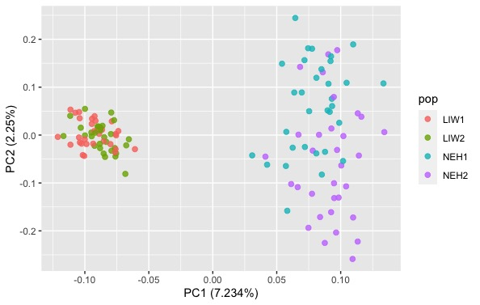
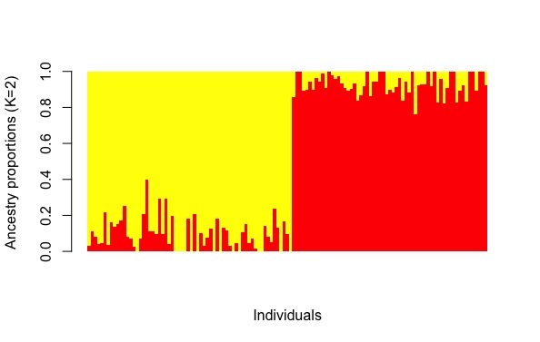
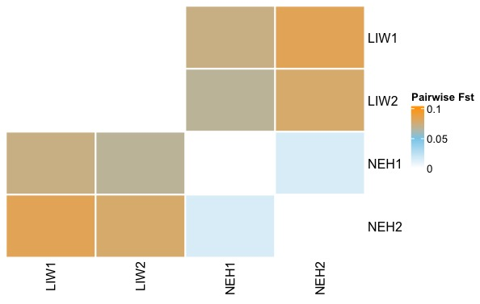

## Welcome to the 2022 Consortium SNP Array Data Analysis Workshop -- session for population genetic analyses  

This repository includes scripts and data associated with the practical sessions of population genetic analyses\
Prepared by Honggang Zhao, and Matt Hare in Sep 2022

All the tutorial can be completed with the R/Rstudio. We encourge you to pre-install the R packages that needed for data analyses. These include

[RStudio](https://www.rstudio.com/)

[How to install RStudio on Mac](https://teacherscollege.screenstepslive.com/a/1135059-install-r-and-r-studio-for-mac)

[How to install RStudio on Windows](https://techvidvan.com/tutorials/install-r/#install-r-windows)

R package needed for workshop

[SNPrelate](https://www.bioconductor.org/packages/release/bioc/html/SNPRelate.html)\
[ggplot2](https://ggplot2.tidyverse.org/)

Within each block we'll keep some flexibility to have questions or discussion.


## Part1: Handling SNP array data: VCF filtering and formatting


The original vcf file includes 65,893 SNPs and 125 inviduals. 


```R
vcftools  = "/Users/HG/Dropbox/Mac/Documents/HG/Github/BioinfoTools/vcftools_0.1.13/bin/vcftools";
plink  = "/Users/HG/Dropbox/Mac/Documents/HG/Domestication/14_ROH/plink";
bcftools = "/Users/HG/Dropbox/Mac/Documents/HG/Github/BioinfoTools/bcftools/bcftools";
```

First is to filter vcf to retain SNPs with minor allele frequency of 0.05 and call rate of 0.95.

```R
system(paste(vcftools," --vcf example_66k_n125.recode.vcf --maf 0.05 --max-missing 0.95 --recode --recode-INFO-all --out example_66k_n125_maf05_maxmissing95", sep=""))

# VCFtools - v0.1.13
# (C) Adam Auton and Anthony Marcketta 2009

# Parameters as interpreted:
# 	--vcf example_66k_n219.vcf
# 	--recode-INFO-all
# 	--maf 0.05
# 	--max-missing 0.95
# 	--out example_66k_n219_maf05_maxmissing95
# 	--recode

# After filtering, kept 219 out of 219 Individuals
# Outputting VCF file...
# After filtering, kept 57570 out of a possible 65893 Sites
# Run Time = 5.00 seconds
```

Next we will filter the SNPs based on Hardy-Weinberg equilibrium 

```R
# filter for HWE
system(paste("./filter_hwe_by_pop.pl -v example_66k_n219_maf05_maxmissing95.recode.vcf -p popmap.txt -h 0.01 -c 0.5 -o example_66k_n219_maf05_maxmissing95_hwe"))
 
#filter_hwe_by_pop.pl -v <vcffile> -p <popmap> [options]
#
#    Options: -v <vcffile> input vcf file -p <popmap> tab-separated file of
#    samples and population designations -h [hwe] minimum Hardy-Weinberg
#    p-value cutoff for SNPs -c [cutoff] proportion of all populations that a
#    locus can be below HWE cutoff without being filtered -o [out] name of outfile

# Processing population: DBW1 (31 inds)
# Processing population: DBW2 (32 inds)
# Processing population: DBX2 (31 inds)
# Processing population: LIW1 (31 inds)
# Processing population: LIW2 (30 inds)
# Processing population: NEH1 (32 inds)
# Processing population: NEH2 (32 inds)
# Outputting results of HWE test for filtered loci to 'filtered.hwe'
# Kept 55462 of a possible 57570 loci (filtered 2108 loci)
```
 
Then we evaluate the vcf file for indiviaul call rate, SNP call rate, and the allele frequency distribution

```R
# evaluate the invidual missing rate, SNP call rate and allele frequency distribution
system(paste(vcftools," --vcf example_66k_n219_maf05_maxmissing95_hwe.recode.vcf --missing-indv --out example_66k_n219_maf05_maxmissing95_hwe")
system(paste(vcftools,"  --vcf example_66k_n219_maf05_maxmissing95_hwe.recode.vcf --missing-site --out example_66k_n219_maf05_maxmissing95_hwe")
system(paste(vcftools,"  --vcf example_66k_n219_maf05_maxmissing95_hwe.recode.vcf --freq2 --max-alleles 2 --out example_66k_n219_maf05_maxmissing95_hwe")
```

Usually we want to perform population analyses on indepedent and neutral SNP, here we will perform a LD-clumping step.

```R
# LD clumping 
f_name="example_66k_n219_maf05_maxmissing95_hwe"
f_bk = paste0(f_name, ".bk")
if (file.exists(f_bk)) {
  #Delete file if it exists
  file.remove(f_bk)
}

snp_readBed(paste0(f_name, ".bed"))
# this will create a .rds file
obj.bigSNP <- snp_attach(paste0(f_name, ".rds"))
G <- obj.bigSNP$genotypes
SNPs <- obj.bigSNP$map$marker.ID
CHR <- obj.bigSNP$map$chromosome
POS <- obj.bigSNP$map$physical.pos
# check if there is any missing values as NA
#big_counts(G, ind.col = 1:dim(G)[1]) # normally the data include missing values
# genotype imputation
G <- snp_fastImputeSimple(G, method = c("mean0"), ncores = 8) # mean0 is based on rounded mean
#big_counts(G, ind.col = 1:dim(G)[1]) # check if NAs are 0
# LD clumping using r2 = 0.2
newpc <- snp_autoSVD(G, infos.chr = CHR, infos.pos = POS, thr.r2 = 0.2, size = 10) # size is the window size of 10K
# extract SNPs after clumpping
which_pruned = attr(newpc, 'subset')
keep_snp_ids = SNPs[which_pruned]
write.table(keep_snp_ids, file = paste0(f_name, "_thinned_SNP.txt"), sep = "\t", quote = FALSE, row.names = FALSE, col.names = FALSE)
print(paste0("SNPs after clumpping is: ", length(keep_snp_ids), " out of ", dim(obj.bigSNP$map)[1]))

# generate thinned vcf file
system(paste(vcftools," --vcf ",f_name,".recode.vcf", " --snps ", f_name, "_thinned_SNP.txt", " --recode --recode-INFO-all --out ", f_name, "_thinned", sep=""))

# VCFtools - v0.1.13
# (C) Adam Auton and Anthony Marcketta 2009

# Parameters as interpreted:
# 	--vcf example_66k_n219_maf05_maxmissing95_hwe.recode.vcf
# 	--recode-INFO-all
# 	--out example_66k_n219_maf05_maxmissing95_hwe_thinned
# 	--recode
# 	--snps example_66k_n219_maf05_maxmissing95_hwe_thinned_SNP.txt

# After filtering, kept 219 out of 219 Individuals
# Outputting VCF file...
# After filtering, kept 46008 out of a possible 55462 Sites
# Run Time = 3.00 seconds

```
 
## Part2: Principal component analysis (PCA) 

```R
library(SNPRelate)
library(ggplot2)
# load vcf file 
vcf.fn <- "example_66k_n219_maf05_maxmissing95_hwe_thinned.recode.vcf"
# VCF => GDS
snpgdsVCF2GDS(vcf.fn, "example_66k_n219_maf05_maxmissing95_hwe_thinned.recode.gds", method="biallelic.only")
# summary
snpgdsSummary("example_66k_n219_maf05_maxmissing95_hwe_thinned.recode.gds")
# Open the GDS file
genofile <- snpgdsOpen("example_66k_n219_maf05_maxmissing95_hwe_thinned.recode.gds")
# PCA function
pca <- snpgdsPCA(genofile,autosome.only=FALSE)
pc.percent <- pca$varprop*100
head(round(pc.percent, 2))
# For data sets with a handful of dimensions, one typically retains the first few PCs. 
tab <- data.frame(sample.id = pca$sample.id,
                  EV1 = pca$eigenvect[,1],    # the first eigenvector
                  EV2 = pca$eigenvect[,2],    # the second eigenvector
                  EV3 = pca$eigenvect[,3],    # the second eigenvector
                  EV4 = pca$eigenvect[,4],    # the second eigenvector
                  stringsAsFactors = FALSE)
print(tab)
# output the tab contents for modification
write.table(tab, "sample_eigen_219.txt", row.names=F, sep="\t", quote=F,col.names=T)
tab_pop = read.delim("sample_eigen_219.txt", header = TRUE, sep='\t')
tab_pop$pop = stringr::str_remove(tab_pop$sample.id, "-[0-9]+")

ggplot(tab_pop, aes(x = EV1, y = EV2)) + 
  geom_point(size=2, aes(color=pop), alpha = 0.8)+
  guides(fill = guide_legend(override.aes=list(shape=17)))+
  scale_x_continuous(paste("PC1 (",round(pc.percent[1],3),"%", ")",sep="")) + 
  scale_y_continuous(paste("PC2 (",round(pc.percent[2],3),"%",")",sep=""))
```



## Part3: Population structure

```R

library(LEA)

#change vcf to geno 
LEA::vcf2geno("example_66k_n219_maf05_maxmissing95_hwe_thinned.recode.vcf",
              output.file = "example_66k_n219_maf05_maxmissing95_hwe_thinned.geno")

#modeling ancestry proportions for different K: from K=1 to K=10
obj <- snmf("example_66k_n219_maf05_maxmissing95_hwe_thinned.geno", K = 1:10, ploidy = 2,
            entropy = T, CPU =4, project = "new")

# Find the best K from cross-entropy
plot(obj, col = "blue4", cex = 1.4, pch = 19) #---best is 6 here

#choose the best LEA run
best = which.min(cross.entropy(obj, K = 3))

# Plot ancestry proportions across samples
barchart(obj, K=3,run=best,border=NA,space=0,
         col=c("red","yellow","blue"),
         xlab = "Individuals", ylab = "Ancestry proportions (K=3)")
```



## Part4: Fst statistics

```R
library(hierfstat)
library(vcfR)
library(ComplexHeatmap)
library(circlize)

# load the population information
tab_pop <- read.delim("sample_eigen_219.txt", header = TRUE, sep='\t')
tab_pop$pop = stringr::str_remove(tab_pop$sample.id, "-[0-9]+")
# load vcf file and convert it to genind format
vcf_file = "example_66k_n219_maf05_maxmissing95_hwe_thinned.recode.vcf"
vcf <- read.vcfR(vcf_file, verbose = FALSE)
df <- vcfR2genind(vcf)
df@pop <- factor(tab_pop$pop)
pairwise_fst <- genet.dist(df, method = "WC84") # Estimates pairwise FSTs according to Weir and Cockerham (1984)

plot_dt <- as.matrix(pairwise_fst)

Heatmap(plot_dt, name = "Pairwise Fst",
        col = colorRamp2(c(0, 0.05, 0.1), c("white", "skyblue", "orange")),
        rect_gp = gpar(col = "white", lwd = 2),
        cluster_rows = FALSE, 
        cluster_columns = FALSE)

```



## cheatsheet for R code
[cheatsheet](https://www.rstudio.com/resources/cheatsheets/)
