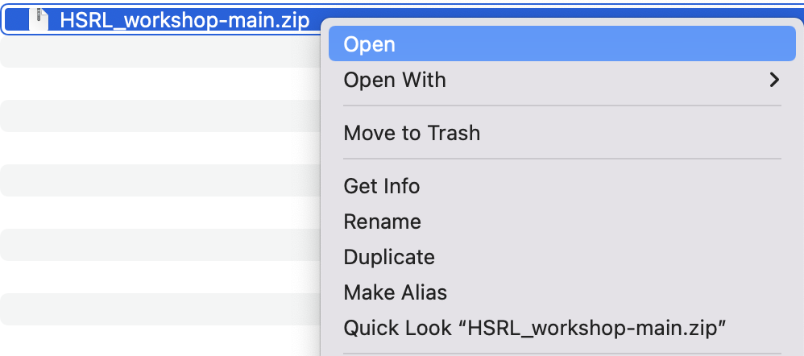
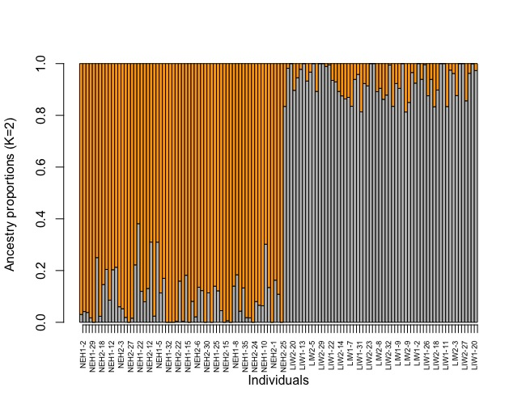

## Welcome to the 2022 Consortium SNP Array Data Analysis Workshop -- session for population genetic analyses  

This repository includes scripts and data associated with the practical sessions of population genetic analyses\
Prepared by Honggang Zhao, and Matt Hare in Sep 2022

## Installation of R/RStudio

All the tutorial can be completed with the R/Rstudio. We encourge you to pre-install the R packages and look over related tutorials that needed for data analyses. 

[R](https://www.r-project.org/): R is a free software environment for statistical computing and graphics. It compiles and runs on a wide variety of UNIX platforms, Windows and MacOS. The current R version can be downloaded [here](https://cloud.r-project.org/). Please download the R for your operation system. For MacOS purchased after 2020, please install the R with Apple silicon arm64 build (e.g., [R-4.2.1-arm64.pkg](https://cloud.r-project.org/bin/macosx/big-sur-arm64/base/R-4.2.1-arm64.pkg))

[RStudio](https://www.rstudio.com/): RStudio is an integrated environment for R, a platform helps with code running and data visulization. Note RStudio is not functional without an installation of R. So please install the R before using RStudio. 

[How to install R and RStudio on Mac](https://teacherscollege.screenstepslive.com/a/1135059-install-r-and-r-studio-for-mac)

[How to install R and RStudio on Windows](https://techvidvan.com/tutorials/install-r/#install-r-windows)

## Cheatsheet for R code
[Cheatsheet](https://www.rstudio.com/resources/cheatsheets/)

## R packages needed for workshop

Tips for R package installation:
1. Alway type `library("PACKAGE NAME")` in the [RStudio Console](https://swcarpentry.github.io/r-novice-inflammation/09-supp-intro-rstudio/index.html) to check if the package has been properly installed or not.
2. Question: what should I do when seeing a message like this: *"Do you want to install from sources the packages which need compilation? (Yes/no/cancel)” and “Update all/some/none? [a/s/n]”*.\
The RStudio asks because the package has updated recently on CRAN but the binary isn't yet available for your OS. Therefore the package manager may need alternative ways to install the SNPrelate. [Yes] should update everything to its latest version (e.g., from the Github), but only if you installed the latest version of pacakge. [No] will ensure that all packages get updated, but not necessarily to their latest versions.  [cancel] will quit the installation process. I would recommand to click "Yes" and check if there is any error message. For question related to *“Update all/some/none? [a/s/n]”*, most the time the ```n``` option works.\
3. Question: what should I do when seeing a message like this: *"compilation failed for package ‘XXXXXX’"*\
You need to check the codes surrounding the error message and figure out where the error comes from. For example, when one saw an error message like this:
```
ld: warning: directory not found for option '-L/usr/local/gfortran/lib/gcc/11'
ld: library not found for -lquadmath
clang: error: linker command failed with exit code 1 (use -v to see invocation)
make: *** [‘XXXXXX’] Error 1
ERROR: compilation failed for package ‘XXXXXX’
```
After some Google search, one can sucessfully install the target package by re-installing the [gfortran](https://cran.r-project.org/bin/macosx/tools/gfortran-6.1.pkg)\
4. Always looking for answers by Googling key words in the error message. There is a whole R community in the internet to support you.

***
[LEA](https://bioconductor.org/packages/release/bioc/html/LEA.html): LEA is an R package dedicated to population genomics, landscape genomics and genotype-environment association tests. The tutorial of LEA is [here](http://membres-timc.imag.fr/Olivier.Francois/LEA/files/LEA_github.pdf)

How to install:
```
if (!require("BiocManager", quietly = TRUE))
    install.packages("BiocManager")

BiocManager::install("LEA")

# load LEA
library(LEA)
```

***
[hierfstat](https://cran.r-project.org/web/packages/hierfstat/index.html): The hierfstat package is intended for the analysis of population structure using genetic markers. It is suitable for both haploid and diploid data. In particular, it contains functions to estimate and test hierarchical F-statistics for any number of hierarchical levels.. The tutorial of hierfstat is [here](https://cran.r-project.org/web/packages/hierfstat/vignettes/hierfstat.html)

How to install:
```
You will need the package devtools to be able to install the devel version of hierfstat. To install devtools:

install.packages("devtools")

#install hierfstat from devtools:
library(devtools)
install_github("jgx65/hierfstat")

# load hierfstat
library(hierfstat)
```

Tips for hierfstat installation:
A message will appear during hierfstat installation:

```
Loading required package: usethis
> install_github("jgx65/hierfstat")
Downloading GitHub repo jgx65/hierfstat@HEAD
These packages have more recent versions available.
It is recommended to update all of them.
Which would you like to update?

1: All                           
2: CRAN packages only            
3: None                          
4: httpuv (1.6.5 -> 1.6.6) [CRAN]

Enter one or more numbers, or an empty line to skip updates:
```
An empty line is fine for installation.

***
[vcfR](https://cran.r-project.org/web/packages/vcfR/index.html): vcfR is an R package that facilitates easy manipulation of variant call format (VCF) data. The tutorial of vcfR is [here](https://cran.r-project.org/web/packages/vcfR/vignettes/intro_to_vcfR.html)

How to install:
```
# install the BiocManager from CRAN using the base R install.packages() function
install.packages("BiocManager")

# install the vcfR package from bioconductor using BiocManager::install()
BiocManager::install("vcfR")

# load vcfR
library(vcfR)
```

***
[SNPfiltR](https://devonderaad.github.io/SNPfiltR/index.html): SNPfiltR is an R package to streamline and automate the process of choosing appropriate filtering parameters for next-gen SNP datasets. The tutorial of SNPfiltR is [here](https://devonderaad.github.io/SNPfiltR/articles/reproducible-vignette.html)

How to install:
```
#Install current release from CRAN
install.packages("SNPfiltR")

#Install current development version directly from GitHub
library(devtools)
install_github("DevonDeRaad/SNPfiltR")

# load SNPfiltR
library(SNPfiltR)
```

## R Visualization tools 

[pheatmap](https://www.rdocumentation.org/packages/pheatmap/versions/1.0.12/topics/pheatmap): A function to draw clustered heatmaps where one has better control over some graphical parameters such as cell size, etc. The tutorial of pheatmap is [here](https://davetang.org/muse/2018/05/15/making-a-heatmap-in-r-with-the-pheatmap-package/)

How to install:
```
#The package can be installed from CRAN:
install.packages("pheatmap")

# load pheatmap
library(pheatmap)
```
***
[ggplot2](https://ggplot2.tidyverse.org/)

How to install:
```
# The easiest way to get ggplot2 is to install the whole tidyverse:
install.packages("tidyverse")

# Alternatively, install just ggplot2:
install.packages("ggplot2")

# Or the development version from GitHub:
# install.packages("devtools")
devtools::install_github("tidyverse/ggplot2")

# load ggplot2
library(ggplot2)
```

## Optional package for linkage disequilibrium (LD) clumping

[bigsnpr](https://cran.r-project.org/web/packages/bigsnpr/readme/README.html)(optional): bigsnpr is an R package for the analysis of massive SNP arrays, primarily designed for human genetics. The tutorial of bigsnpr is [here](https://privefl.github.io/bigsnpr/index.html)

```
# install.packages("remotes")
remotes::install_github("privefl/bigsnpr")
or for the CRAN version

install.packages("bigsnpr")

# load bigsnpr
library(bigsnpr)
```

***

Within each block below we'll keep some flexibility to have questions or discussion.

## Part0: set up the working directory for RStudio

### Step 1: Unzip the compressed file at Desktop

`Mac`\
Double-click on the zipped file to unzip HSRL_workshop.zip file on your Mac



`Windows`\
Right-click - Extract All\


### Step 2: set up the working directory
```
#set up the working directory
setwd("~/Desktop/HSRL_workshop")
```

Or click Session-Set Working Directory-Choose Directory and direct to HSRL_workshop in the Desktop

`Mac`\


`Windows`\


## Part1: Handling SNP array data: VCF filtering and formatting


The Variant Call Format (VCF) file is a data format produced by variant calling software (e.g. Axiom Analysis Suite, GATK, FreeBayes, SAMtools). It contains the information for polymorphic loci (variants) present in the sample or population. The variants can be single nucleotide polymorphism (SNP) or a stretch of insertions or deletions (INDEL). In the VCF file, the variant data is normally represented by 8 columns (#CHROM, POS, ID, REF, ALT, QUAL, FILTER and INFO). The INFO columns contain additional information about the variants, for details of the columns headers please see [here](https://www.reneshbedre.com/blog/vcf-fields.html). 

In this demo we will use a vcf file produced from SNP array and converted by Axiom Analysis Suite. The file includes 65,893 SNPs (i.e., 66K array markers) and 125 individuals from four populations. 

Detailed information for four populations,

|     Population                             | Abbr | N  | Salinity    | Origin          |
|--------------------------------------------|------|----|-------------|-----------------|
| Lloyd harbor, NY, Long Island Sound wild 1 | LIW1 | 31 | High        | Wild population |
| Niantic Bay, CT, Long Island Sound wild 2  | LIW2 | 30 | High        | Wild population |
| Rutgers NEH 19N1357                        | NEH1 | 32 | High, 18-23 | Selected line   |
| Rutgers NEH 20N1                           | NEH2 | 32 | High, 18-23 | Selected line   |

### Step 1:

#### load vcf using SNPfiltR and snpR

```r
library(SNPfiltR)
#This is SNPfiltR v.1.0.0

#Detailed usage information is available at: devonderaad.github.io/SNPfiltR/ 

#If you use SNPfiltR in your published work, please cite the following papers: 

#DeRaad, D.A. (2022), SNPfiltR: an R package for interactive and reproducible SNP filtering. Molecular Ecology Resources, 00, 1-15. http://doi.org/10.1111/1755-0998.13618 

#Knaus, Brian J., and Niklaus J. Grunwald. 2017. VCFR: a package to manipulate and visualize variant call format data in R. Molecular Ecology Resources, 17.1:44-53. http://doi.org/10.1111/1755-0998.12549
library(vcfR)
#   *****       ***   vcfR   ***       *****
#   This is vcfR 1.13.0 
#     browseVignettes('vcfR') # Documentation
#     citation('vcfR') # Citation
#   *****       *****      *****       *****
```

```r
#read in vcf as vcfR
vcfR <- read.vcfR("./example_66k_n125.recode.vcf")
# Scanning file to determine attributes.
# File attributes:
#   meta lines: 416
# header_line: 417
# variant count: 65893
# column count: 134
# Meta line 416 read in.
# All meta lines processed.
# gt matrix initialized.
# Character matrix gt created.
# Character matrix gt rows: 65893
# Character matrix gt cols: 134
# skip: 0
# nrows: 65893
# row_num: 0
# Processed variant: 65893
# All variants processed
```

```r
#generate popmap file. Two column popmap with 'id' and 'pop'
popmap<-data.frame(id=colnames(vcfR@gt)[2:length(colnames(vcfR@gt))],pop=substr(colnames(vcfR@gt)[2:length(colnames(vcfR@gt))], 1,4))
#check the first few content in popmap
head(popmap)
#        id  pop
# 1  LIW2-4 LIW2
# 2 LIW2-12 LIW2
# 3 LIW2-20 LIW2
# 4 LIW2-28 LIW2
# 5  LIW1-5 LIW1
# 6 LIW1-13 LIW1
```

### Step 2:
#### Quality filtering for missing data and minor allele counts

Checking missing data by SNP and the effect of various cutoffs on the missingness of each sample
```r
missing_by_snp(vcfR)
# cutoff is not specified, exploratory visualizations will be generated
# Picking joint bandwidth of 0.0318
# filt missingness snps.retained
# 1  0.30 0.009288421         65668
# 2  0.50 0.009288421         65668
# 3  0.60 0.009288421         65668
# 4  0.65 0.009288421         65668
# 5  0.70 0.009288421         65668
# 6  0.75 0.009288421         65668
# 7  0.80 0.009268435         65662
# 8  0.85 0.009231435         65647
# 9  0.90 0.009128934         65584
# 10 0.95 0.008457778         64800
# 11 1.00 0.000000000         29965
```


Choose a value that retains an acceptable amount of missing data in each SNP, here we require that each SNP with <5% missing data
```r
vcfR_missing<-missing_by_snp(vcfR, cutoff = .95)
# cutoff is specified, filtered vcfR object will be returned
# 1.66% of SNPs fell below a completeness cutoff of 0.95 and were removed from the VCF
```


Filtering based on minor allele count. Here we used a setting of minor allele count 6, which roughly equal to minor allele frequency of 5% (125*0.05=6.25)
```r
vcf_missing_mac = min_mac(vcfR_missing, min.mac = 6)
# 5% of SNPs fell below a minor allele count of 6 and were removed from the VCF
``` 

Write out vcf files for downstream analyses.
```r
vcfR::write.vcf(vcf_missing_mac, "./example_66k_n125_missing95_mac6.vcf.gz")
```

### Step 3 (Optional):
#### Quality filter the SNPs based on Hardy-Weinberg equilibrium (HWE). 

Here we will use a Perl script from dDocent pipeline to filter out SNPs based on HWE. The HWE test is not supposed to be conducted across the board, since population structure will create departures from HWE. We need to apply this by population. This script is a Perl wrapper for vcftools. One need to install the vcftools before running the script. Therefore this step 3 is an optional step. 

Detailed command is shown below,

```r
filter_hwe_by_pop.pl -v <vcffile> -p <popmap> [options]
Options:
-v    vcf_file input vcf file
-p    popmap  tab-separated file of samples and population designations
-h    hwe minimum Hardy-Weinberg p-value cutoff for SNPs
-c    cutoff  proportion of all populations that a locus can be below HWE cutoff without being filtered
-o    out name of outfile
```

```r
# load R.utils
library(R.utils)
# uncompressed the vcf.gz
gunzip("./example_66k_n125_missing95_mac6.vcf.gz", remove=FALSE)
# filter_hwe_by_pop.pl for SNP HWE filtering. The input is vcf file after minor allele count and missing rate filtering.
system(paste("./filter_hwe_by_pop.pl -v example_66k_n125_missing95_mac6.vcf -p popmap.txt -h 0.01 -c 0.5 -o example_66k_n125_missing95_mac6_hwe"))
# Processing population: LIW1 (31 inds)
# Processing population: LIW2 (30 inds)
# Processing population: NEH1 (32 inds)
# Processing population: NEH2 (32 inds)
# Outputting results of HWE test for filtered loci to 'filtered.hwe'
# Kept 60024 of a possible 61561 loci (filtered 1537 loci)
```

### Step 4 (Optional):
#### Making a linkage-disequilibrium (LD) clumped vcf

Linkage disequilibrium can particularly bias the downstrem population genetic analysis. SNPs in LD can be due to regions of low-recombination, variable SNP density, structural rearrangements, selection, etc. A good practice to assess neutral structure is to use a LD-clumping set of indepedent SNPs. Because this step involves a lot of steps and requrie a basic understanding of Plink usage. We will skip this step. However, I have already created a vcf file after LD-clumping and randomly seleted 10K SNPs for the following population genetic analysis.

```R
library(bigsnpr)
plink  = "/Users/HG/Dropbox/Mac/Documents/HG/Domestication/14_ROH/plink";
vcftools  = "/Users/HG/Dropbox/Mac/Documents/HG/Github/BioinfoTools/vcftools_0.1.13/bin/vcftools";

system(paste(plink, " --vcf example_66k_n125_missing95_mac6_hwe.recode.vcf --allow-extra-chr --make-bed --out example_66k_n125_missing95_mac6_hwe", sep=""))
# LD clumping 
f_name="example_66k_n125_missing95_mac6_hwe"
f_bk = paste0(f_name, ".bk")
if (file.exists(f_bk)) {
  #Delete file if it exists
  file.remove(f_bk)
}
snp_readBed(paste0(f_name, ".bed"))
# this will create a .rds file
obj.bigSNP <- snp_attach(paste0(f_name, ".rds"))
G <- obj.bigSNP$genotypes
SNPs <- obj.bigSNP$map$marker.ID
CHR <- obj.bigSNP$map$chromosome
POS <- obj.bigSNP$map$physical.pos
# check if there is any missing values as NA
#big_counts(G, ind.col = 1:dim(G)[1]) # normally the data include missing values
# genotype imputation
G <- snp_fastImputeSimple(G, method = c("mean0"), ncores = 8) # mean0 is based on rounded mean
# LD clumping using r2 = 0.2
newpc <- snp_autoSVD(G, infos.chr = CHR, infos.pos = POS, thr.r2 = 0.2, size = 10) # size is the window size of 10K
# extract SNPs after clumpping
which_pruned = attr(newpc, 'subset')
keep_snp_ids = SNPs[which_pruned]
write.table(keep_snp_ids, file = paste0(f_name, "_clump_SNP.txt"), sep = "\t", quote = FALSE, row.names = FALSE, col.names = FALSE)
print(paste0("SNPs after clumpping is: ", length(keep_snp_ids), " out of ", dim(obj.bigSNP$map)[1]))
# "SNPs after clumpping is: 45675 out of 60024"
# generate random 1K SNP dataset after LD-clumping
system(paste(vcftools," --vcf ",f_name,".recode.vcf --snps example_66k_n125_missing95_mac6_hwe_LD_clump_1K.txt --recode --recode-INFO-all --out ", f_name, "_LD_clump", sep=""))
# VCFtools - v0.1.13
# (C) Adam Auton and Anthony Marcketta 2009

# Parameters as interpreted:
#   --vcf example_66k_n125_missing95_mac6_hwe.recode.vcf
#   --recode-INFO-all
#   --out example_66k_n125_missing95_mac6_hwe_LD_clump
#   --recode
#   --snps example_66k_n125_missing95_mac6_hwe_LD_clump_1K.txt

# After filtering, kept 125 out of 125 Individuals
# Outputting VCF file...
# After filtering, kept 1000 out of a possible 60024 Sites
# Run Time = 0.00 seconds
```
 
## Part2: Principal component analysis (PCA) 

One of the basic thing in population genetics is to assess the genetic structure across the samples. It can be done by looking into PCA or STRUCTURE/ADMIXTURE analysis, as well as by looking into pairwise Fst between populations. 

Population structure leads to systematic difference between individuals, which is often visualized using dimension reduction techniques such as principal component analysis (PCA). The results of PCA can show genetic clusters that reflect the genetic variation across geographical location or seletive breeding process in our case. Using PCA in genomics is quite simple without the need to diving into the math.

```R
library(SNPfiltR)
library(vcfR)

#read in vcf as vcfR
vcfR <- read.vcfR("./example_66k_n125_missing95_mac6_hwe_LD_clump.recode.vcf")

#generate popmap file. Two column popmap with 'id' and 'pop'
popmap<-data.frame(id=colnames(vcfR@gt)[2:length(colnames(vcfR@gt))],pop=substr(colnames(vcfR@gt)[2:length(colnames(vcfR@gt))], 1,4))

#check the first few content in popmap
head(popmap)
#        id  pop
# 1  LIW2-4 LIW2
# 2 LIW2-12 LIW2
# 3 LIW2-20 LIW2
# 4 LIW2-28 LIW2
# 5  LIW1-5 LIW1
# 6 LIW1-13 LIW1

# This PCA function in SNPfiltR can be run in two ways: 1) Without ’thresholds’ specified. This will run a PCA for
# the input vcf without filtering, and visualize the clustering of samples in two-dimensional space,
# coloring each sample according to a priori population assignment given in the popmap. 2) With
# ’thresholds’ specified. This will filter your input vcf file to the specified missing data thresholds, and
# run a PCA for each filtering iteration. For each iteration, a 2D plot will be output showing clustering
# according to the specified popmap. This option is ideal for assessing the effects of missing data on
# clustering patterns. Here we only perform PCA analysis without any threshold because we already did filtering. 

assess_missing_data_pca(vcfR=vcfR, popmap = popmap, thresholds=NULL,clustering = FALSE)
# PC1         PC2          PC3          PC4         PC5          PC6  pop missing
# LIW2-4  -1.852227 -1.05170167  0.247838364 -0.863061906  0.24017122 -0.683284771 LIW2   0.021
# LIW2-12 -2.626299 -0.15541527  0.326833089 -0.003319538  0.50306522 -0.546013466 LIW2   0.012
# LIW2-20 -2.650282 -0.06764961  0.258587792  0.323243020  0.19597806  0.562968446 LIW2   0.005
# LIW2-28 -2.397931 -0.41782601  0.232969544  0.284140457  0.62197105  0.160899188 LIW2   0.007
# LIW1-5  -2.629874  0.27033184  0.836668673 -0.374729046  0.03233905 -0.450838278 LIW1   0.009
```


## Part3: Admixture analysis

Next we will examine the individual admixture coefficients using the snmf function in LEA package. This function provides results that are very similar to programs such as STRUCTURE or Admixture. Assuming K ancestral populations, the function snmf provides least-squares estimates of ancestry proportions rather than maximum likelihood estimates (Frichot 2014). The results allow us to determine what is the best K value, i.e. the most likely number of genetic clusters.

```r
# lead LEA package
library(LEA)

#change vcf to geno 
LEA::vcf2geno("example_66k_n125_missing95_mac6_hwe_LD_clump.recode.vcf",
              output.file = "example_66k_n125_missing95_mac6_hwe_LD_clump.geno")
# - number of detected individuals: 125
# - number of detected loci:    1000
# 
# For SNP info, please check example_66k_n125_missing95_mac6_hwe_LD_clump.vcfsnp.
# 
# 0 line(s) were removed because these are not SNPs.
# Please, check example_66k_n125_missing95_mac6_hwe_LD_clump.removed file, for more informations.
# 
# [1] "example_66k_n125_missing95_mac6_hwe_LD_clump.geno"

# modeling ancestry proportions for different K: from K=1 to K=10
obj <- snmf("example_66k_n125_missing95_mac6_hwe_LD_clump.geno", K = 1:10, ploidy = 2,
            entropy = T, CPU =4, project = "new")


# Find the best K from cross-entropy
plot(obj, col = "blue4", cex = 1.4, pch = 19) #---best is 2 here
```


```r
#choose the best LEA run
best = which.min(cross.entropy(obj, K = 2))

# Plot ancestry proportions across samples
barchart(obj, K=2,run=best,border=T,space=0,
         col=c("grey","orange"), lab=tab_pop$pop,
         xlab = "Individuals", ylab = "Ancestry proportions (K=2)") -> bp

axis(1, at = 1:length(bp$order), 
     labels = popmap[bp$order, "id"], las = 3, 
     cex.axis = .5)
```



## Part4: Fst statistics

FST is a relative measure of population differentiation. There are many software and formulas for FST estimation. Here we estimates pairwise FST according to Weir and Cockerham (1984). However, genet.dist function from hierfstat package can estimate some other genetic distances as described mostly in Takezaki & Nei (1996). See [https://www.rdocumentation.org/packages/hierfstat/versions/0.5-11/topics/genet.dist](https://www.rdocumentation.org/packages/hierfstat/versions/0.5-11/topics/genet.dist) for detailed information

```R

library(pheatmap)
library(vcfR)

# load vcf file and convert it to genind format
vcf_file = "example_66k_n125_missing95_mac6_hwe_LD_clump.recode.vcf"
vcf <- read.vcfR(vcf_file, verbose = FALSE)
df <- vcfR2genind(vcf)
df@pop <- factor(popmap$pop)
# calculate pairwise FST using Weir and Cockerham (1984)
pairwise_fst <- genet.dist(df, method = "WC84") # Estimates pairwise FSTs according to Weir and Cockerham (1984)
# convert the output into matrix
plot_dt <- as.matrix(pairwise_fst)
plot_dt
#           LIW1         LIW2       NEH1       NEH2
# LIW1 0.0000000000 0.0001369757 0.07207295 0.08302061
# LIW2 0.0001369757 0.0000000000 0.06707238 0.07771447
# NEH1 0.0720729493 0.0670723811 0.00000000 0.01480227
# NEH2 0.0830206064 0.0777144688 0.01480227 0.00000000

# plot with heatmap
pheatmap(plot_dt, display_numbers = T, cellwidth=40, cellheight=40, main="Pairwise FST")
```


